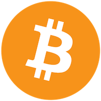
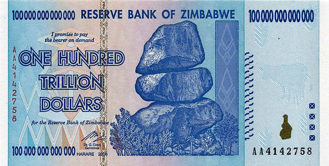

# Introduction au Bitcoin

## ARRETEEEEEEZ TOUUUUUT
## C'EST PAS BON

## On reprend!

# Introduction aux Crypto-Monnaies

(Et il y en a plein...)

## WTF: Qu'est-ce qu'une crypto-monnaie???

1. Une monnaie électronique
2. Qui fonctionne sur base de cryptographie

## Ah ouais? Mais c'est pas une vraie monnaie!

### Eh bien si! Mais posons nous la bonne question:

## Qu'est ce que la monnaie?

> Le dollar du Zimbabwe connaît une hyperinflation. L'inflation en taux annuel atteint 2,2 millions pour cent en juillet 2008 et continue à augmenter. En janvier 2009, des billets de cent mille milliards de dollars zimbabwéens (1014 $) ont été mis en circulation.
> (Wikipedia)

#### Qu'est-ce donc?
La monnaie ou l'argent, représente une unité de compte qui sert d'échange entre personnes et/ou institutions.
#### Quelle est la valeur de l'argent?
La valeur de l'argent varie en fonction du temps, de l'offre, de la demande, des décisions économiques locales et globales.
#### Qui créée de l'argent?
Les Banques centrales, les banques privées...
#### Qui garde de l'argent?
Les Banques centrales, les banques privées, les gens...
#### Et au niveau de la loi?
Largement légiféré depuis longtemps, petite citation:

> En raison de l'importance de la monnaie, les États cherchent très tôt à s'assurer le maximum de pouvoir monétaire. Ils définissent la devise officielle en usage sur leur territoire et font en sorte que cette devise soit symbole et marque de leur puissance. Ils s'arrogent progressivement un peu partout le monopole de l'émission des billets et des pièces et exercent un contrôle sur la création monétaire des banques via la législation et la politique monétaire des banques centrales.
> (Encore Wikipedia, désolé)

Et alors pour le Bitcoin euh les crypto-monnaies?
--------------

#### Qu'est-ce donc?
Les crypto-monnaies, représentent des unités de compte qui sert d'échange entre personnes et/ou institutions.
#### Quelle est la valeur des crypto-monnaies?
La valeur des crypto-monnaies varie en fonction du temps, de l'offre, de la demande (et indirectement des décisions économiques globales).
#### Qui créée les crypto-monnaies?
Des ordinateurs puissants (mineurs)
#### Qui garde les crypto-monnaies?
Personne et tout le monde à la fois
#### Et au niveau de la loi?

## Mais alors quels sont les avantages et les inconvénients des crypto-monnaies?

#### ++ Anonymes

#### ++ Décentralisés

#### ++ Transparents

#### + Fluctuation extreme

#### + F*** le sy****

#### -- Manque d'établissements qui l'acceptent

#### -- Manque de législation qui pourront un jour tomber

#### - Fluctuation extreme

#### - Nécésite un minimum de connaissance

## Vidéos et liens:

[http://dessinemoileco.com](http://dessinemoileco.com)
-> Vidéos 3m: la bourse / les bitoins / la création monétaire

[http://bitcoin.de](http://bitcoin.de)
-> Marché de Bitcoins (achat vente)

[http://bitconseil.fr](http://bitconseil.fr)
-> Tout sur le Bitcoin